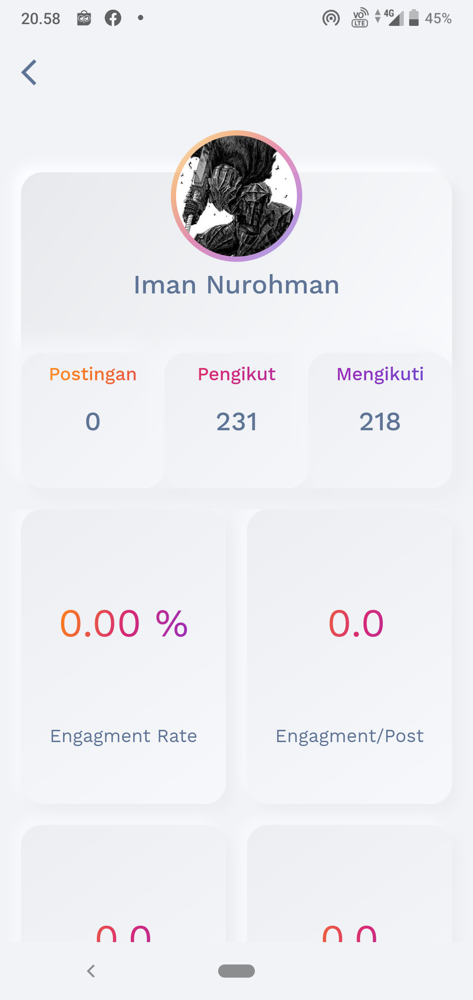
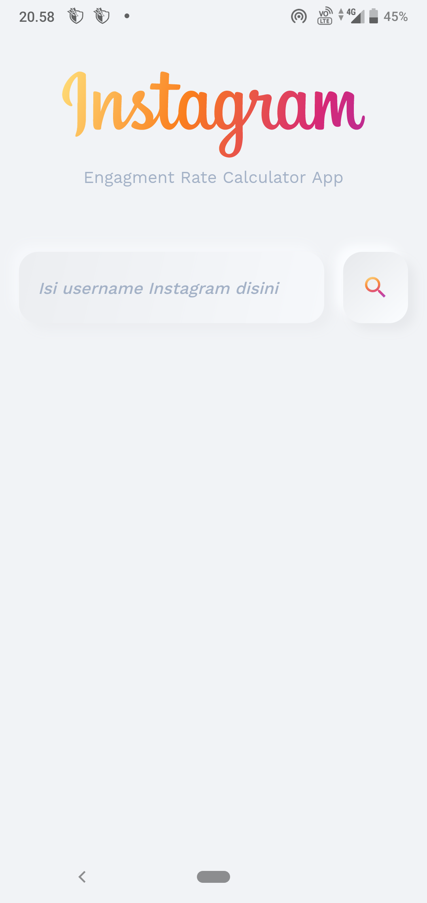

# Engagement Calculator

Application for calculate engagement in instagram

## Screenshots

      

      

## Installation

- Add [Flutter](https://flutter.dev/docs/get-started/install) to your machine

- Open this project folder with Terminal/CMD and run `flutter packages get`

- Run `flutter run` to build and run the debug app on your emulator/phone

